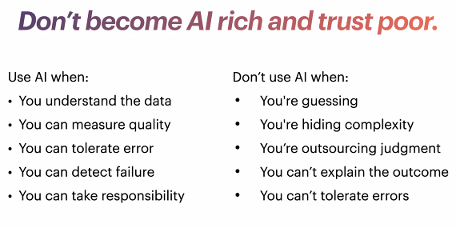

• Stationary, well-defined input-output mapping
• High signal-to-noise ratio
• Labeled, balanced training data
• Clear objective function and feedback signal
• Error tolerance is known and acceptable