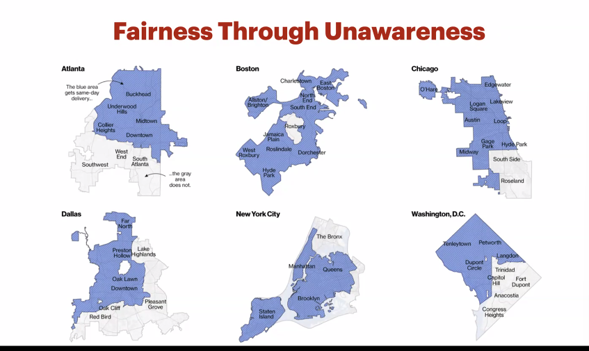

# When to Use AI and When not to use

```txt
Webinar - 
When to use Al?
• Stationary, well-defined input-output mapping
• High signal-to-noise ratio
• Labeled, balanced training data
• Clear objective function and feedback signal
• Error tolerance is known and acceptable
• Stationary, well-defined input-output mapping
• High signal-to-noise ratio
• Labeled, balanced training data
• Clear objective function and feedback signal
• Error tolerance is known and acceptable

AI = function approximation => learns f'(x) from examples of (x,y)

Balanced datasets avoid bias and ensure fairness - without true y, the loss L(y, f'(x)) cannot be minimized
* Diagnosing Data - Data Quality assurance
* Unbalanced dataset
* Skew ratio - 
* Get more Data
* Undersampled
	* Throwing away data incrases risk of overfitting
	* Works only if the problem is simple and separable
* Oversampled - Like copying more test cases of rare scenarios so they don't get ignored during testing
* Loss Weighting - Tell the model that mistakes on the rare class(dogs) are more important than mistakes on the common class(cats). Multiply errors on rare classes by a bigger number so the model "pays extra attention"

* Data Augmentation and Synthetic Data Generation
Instead of collecting more data, we make
small "safe" changes to existing data.
Flip, rotate, change brightness.

Transformations: Flip, rotate, change brightness.
SMOTE: Synthetic Minority Oversampling Technique

* Limitations:
Augmented samples are still variations of the original data —9 no
truly new information.
Assumes transformations don't change the true label
Works well for images, text, and audio, but not always for
structured/tabular data.
Risk of overfitting to transformations (bias replication)
Synthetic samples may not perfectly capture real-world complexity.

* But is well-balanced data good enough?
will it necessarily give you correct models?
will it necessarily give you fair models?
(Loan approval system, fairness policing, FAIR team of Meta)
* Fair ML is paradoxical
Machine learning is stereotyping by definition

Discrimination is the goal! A model that fails to
distinguish between classes is useless.
Stereotyping is the method: Groups are treated as
statistical averages, erasing outliers.

* Fairness starts with the Training data - 
The training data may not be representative
Training set may be biased due to the biases Of the
people collecting or labelling the data
GIGO
Hidden correlations (or confounders)
Selection and survivor biases
Individuals may misremember past situations - selective
perception (Dearborn & Simon,1958)

* Amazon Doesn't consider the Race of its customers. Should it?
	Is Amazon same-day delivery service racist?
```





• Stationary, well-defined input-output mapping
• High signal-to-noise ratio
• Labeled, balanced training data
• Clear objective function and feedback signal
• Error tolerance is known and acceptable