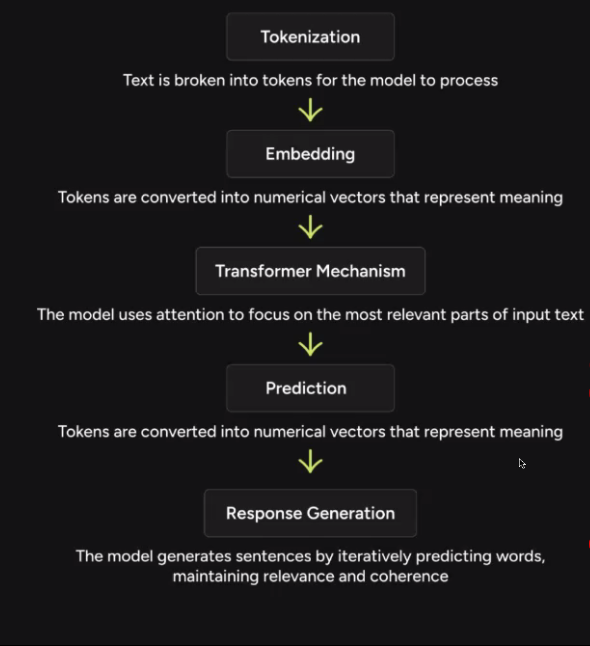
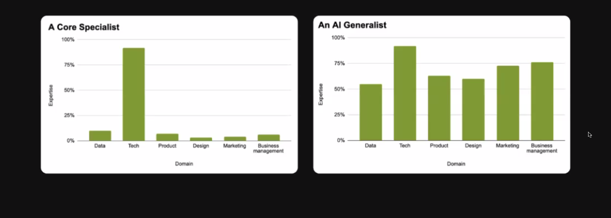
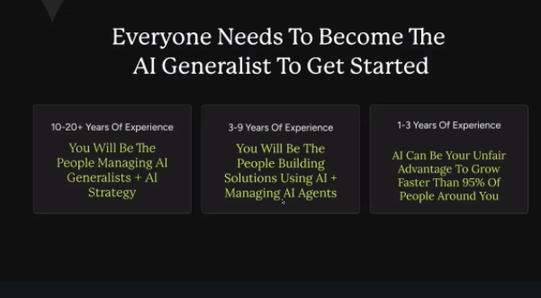
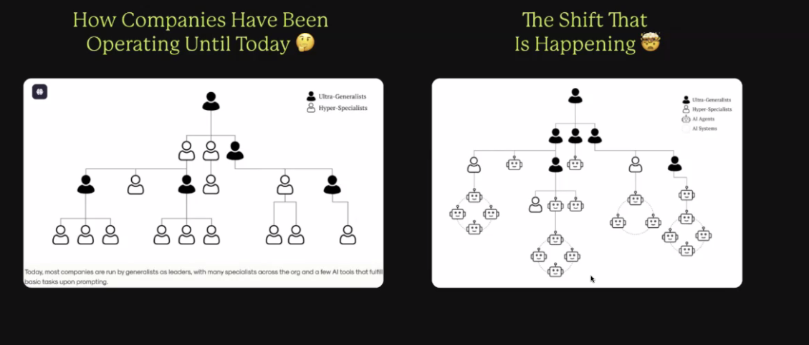
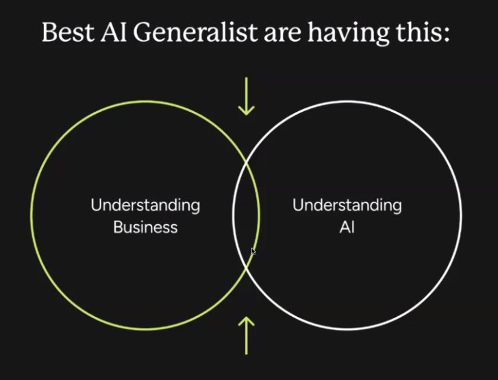
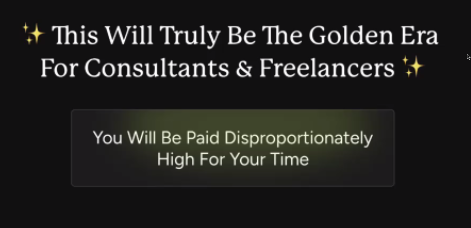
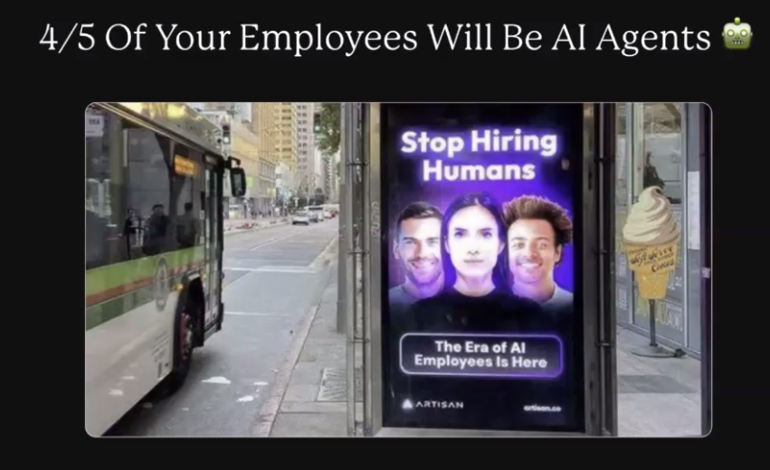
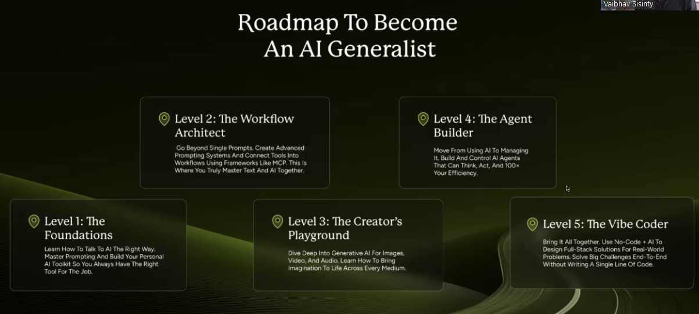

# Multiple Prompting Techniques

# The Magic Prompt Formula

* Write an Email to your 10k subscribers inviting
* Role + Task + Context/Instruction + Data

## Cold Email
Write a cold email to the founder of swiggy asking for a job as an AI generalist. make sure the email
is personalised with recent updatee of swiggy and something specific the founder said recently on
social media. Make sure you read the internet before writing the email. Also fing his email id if
possible.













"arbitrage window"



We are living in Times where Single-person unicorns are a reality

Roatmap to Become an AI Generalist
1. Level 1 - The Foundations
2. Level 2 - The Workflow Architect
3. Level 3 - The Creator's Playground
4. Level 4 - The Agent Builder
5. Level 5 - The Vibe Coder




```txt
You are an expert data analyst. GO through the screenshot Of a
dashboard that I've attached to you. Scrutinize the dashboard to the
minute of the detail and tell me what are the top conclusions out of
this dashboard so that I can present that in my meeting and get some
brownie points, some hidden traits. Also, explain to me this
dashboard like I'm a IO-year-old so that next time I could read this
dashboard all by myself.
```